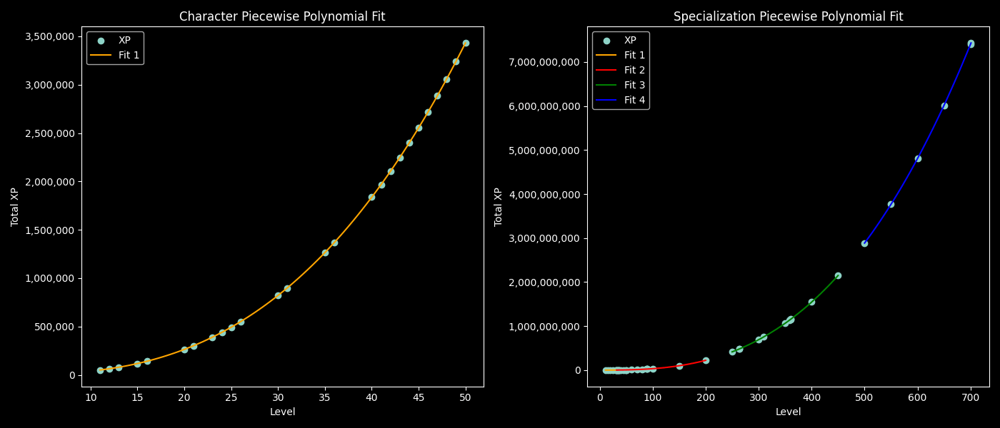

# Level XP Requirements
Figuring out functions to describe the level XP requirements with reasonable accuracy.

Level and XP values should match to avoid visual bugs with in-game counters.\
Setting XP _below_ the expected value for a given level will cause some sort of integer overflow in the GUI counter and it will not show the correct value until you earn enough XP to be back in line with your level's expected range.

XP required for **Character level 50** is `3430227`\
XP required for **Specialization level 701** (enough to max all trees) is `7431910510`

## Research

**3 important numbers for this research:**
- **Level** - the level of the character/specialization.
- **Level-up XP** - the XP required to reach the next level. I catalog this under the level being reached.
- **Total XP** - the cummulative total of all XP earned (sum of all "level-up" values)

**Data collections:**
- [Character XP](../data/xp_character.csv)
- [Specialization XP](../data/xp_specialization.csv)

[Level curve fitting Python script](../scripts/level_curve.py)

### Level-up (net) XP
The game tells us how many XP points we've earned since our last level up and how many net points from the current level are required for the next. This info can be combined with the current total XP in your save file to determine the total XP requirement for both the current and next level.

Ex.\
A character is level 24 with 441675 total XP points (find this near the top of the save file)\
They are at 1954/53192 for the next level-up (find this in-game under the Skills tab)\

From that we can calculate the required total XP for both level 24 and 25, plus we also have the net XP for `24->25`.\
**24:** `439721 = 441675 - 1954`\
**25:** `492913 = 441675 - 1954 + 53192`

We can systematically save-edit to inch upward through each total XP threshold.

Note: It seems like the first few levels (1-4 do not follow the same pattern, so I discard them when approximating the curve)

### How can we predect XP required for a given level?
To predict the XP required for a given level, we can fit a mathematical curve to the collected data points using NumPy’s polyfit function. This function finds the best-fitting polynomial (curve) of a specified degree for our data.

For example, a cubic polynomial (degree 3) has the form:

    XP = a * level³ + b * level² + c * level + d

By passing our level and XP data to np.polyfit(levels, xp, 3), we obtain the coefficients a, b, c, and d that best fit the actual XP requirements. We can then use this formula to estimate the total XP needed for any level, even those not explicitly listed in our data.

In practice:
1. We collect XP data for as many levels as possible.
2. We use Python math libraries to fit cubic curves to this data.
3. The resulting formulas allow us to predict XP requirements with reasonable accuracy.
4. Add a safety margin to estimates to ensure 

**Note:** I don't include leve 1-10 in my calculations - they seem to be adjusted manually and throw off the curves.

## Character Level Total XP Curve

### Segment 1 (levels 11 to 50):

    XP = 20.435970 * level^3 + 445.422020 * level^2 + -5301.029340 * level + 27953.516161

    Divergence for known data points:
      Level  11:   +863 1.72936%
      Level  12:   +280 0.44130%
      Level  13:   -146 0.18362%
      Level  15:   -627 0.52984%
      Level  16:   -720 0.50864%
      Level  20:   -505 0.19103%
      Level  21:   -368 0.12173%
      Level  23:    -69 0.01779%
      Level  24:    +78 0.01768%
      Level  25:   +216 0.04374%
      Level  26:   +338 0.06138%
      Level  30:   +612 0.07450%
      Level  31:   +618 0.06869%
      Level  35:   +410 0.03242%
      Level  36:   +311 0.02274%
      Level  40:   -146 0.00797%
      Level  41:   -248 0.01259%
      Level  42:   -331 0.01573%
      Level  43:   -387 0.01720%
      Level  44:   -408 0.01702%
      Level  45:   -386 0.01513%
      Level  46:   -310 0.01142%
      Level  47:   -173 0.00599%
      Level  48:    +39 0.00128%
      Level  49:   +335 0.01033%
      Level  50:   +726 0.02117%
    Max =======:    863 1.72936%

## Specialization Level Total XP Curve
Results with 4 segments/curves are within 3%. Result with 1-2 curves are pretty poor.

### Segment 1 (levels 11 to 31):

    XP = 83.390778 * level^3 + -2314.676389 * level^2 + 41061.771085 * level + -216525.913214

    Divergence for known data points:
      Level  11:   -431 0.64833%
      Level  15:  +2367 1.50141%
      Level  20:  -6160 1.74933%
      Level  25:  +9109 1.38592%
      Level  30: -16148 1.34583%
      Level  31: +11263 0.86303%
    Max =======:  16148 1.74933%

### Segment 2 (levels 32 to 200):

    XP = 20.903278 * level^3 + 1701.317660 * level^2 + -74334.753724 * level + 1403361.683375

    Divergence for known data points:
      Level  32: +35251 2.48862%
      Level  33: +19805 1.29068%
      Level  34:  +5287 0.31867%
      Level  35:  -8336 0.46559%
      Level  36: -21095 1.09383%
      Level  37: -33028 1.59252%
      Level  40: +41042 1.67596%
      Level  45:  +2943 0.08643%
      Level  49: -17059 0.39468%
      Level  50: -20808 0.45496%
      Level  60: -36730 0.48203%
      Level  70: -26172 0.22308%
      Level  80:  -3783 0.02219%
      Level  88: +15358 0.06897%
      Level  89: +17591 0.07654%
      Level  90: +19766 0.08336%
      Level 100: +37181 0.11674%
      Level 150: -35623 0.03594%
      Level 200:  +8409 0.00379%
    Max =======:  41042 2.48862%

### Segment 3 (levels 250 to 450):

    XP = 16.708444 * level^3 + 4297.272805 * level^2 + -645890.804295 * level + 46158303.367444

    Divergence for known data points:
      Level 250: +27256 0.00658%
      Level 263: -14705 0.00308%
      Level 264: -16593 0.00344%
      Level 300: -13668 0.00198%
      Level 310:  -2657 0.00035%
      Level 350: +15515 0.00146%
      Level 358: +10728 0.00095%
      Level 359:  +9930 0.00087%
      Level 360:  +9089 0.00079%
      Level 361:  +8206 0.00071%
      Level 400: -43666 0.00283%
      Level 450: +10566 0.00049%
    Max =======:  43666 0.00658%

### Segment 4 (levels 500 to 701):

    XP = 14.960904 * level^3 + 6708.446543 * level^2 + -1773218.961259 * level + 224787945.740717

    Divergence for known data points:
      Level 500:  +2730 0.00009%
      Level 550: -10904 0.00029%
      Level 600: +16306 0.00034%
      Level 650: -10774 0.00018%
      Level 700:   +249 0.00000%
      Level 701:  +2392 0.00003%
    Max =======:  16306 0.00034%
